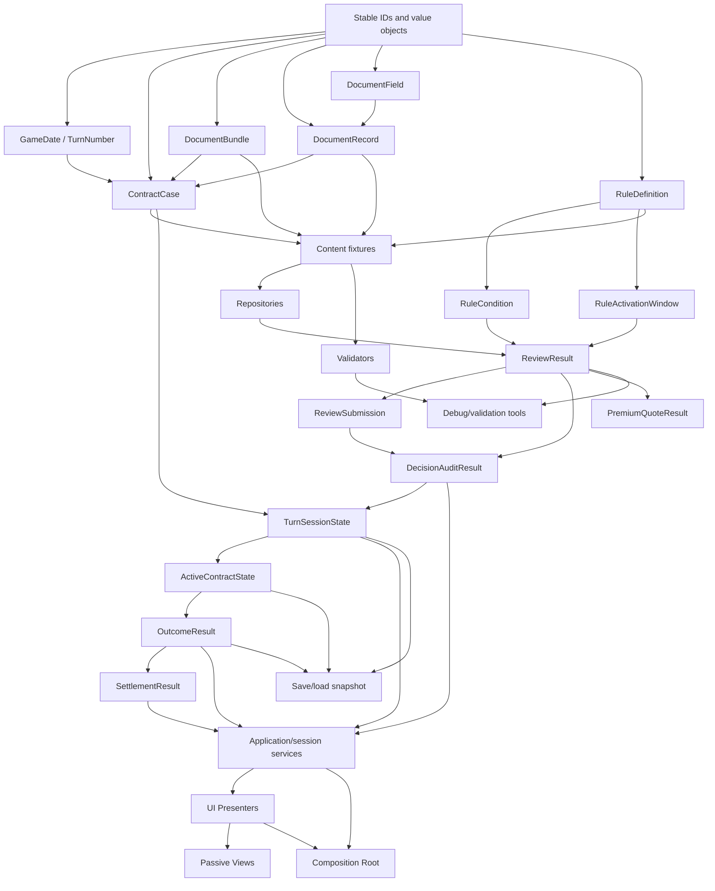

# Start To End Dependency Graph

Last updated: 2026-07-05.

## Graph

## Must Exist Before UI Work Starts

M7 UI work should not begin until these exist and are tested:

- Stable IDs and value objects.
- `GameDate` and `TurnNumber`.
- `ContractCase`.
- `DocumentBundle`, `DocumentRecord`, and `DocumentField`.
- Representative content fixtures and repositories.
- `RuleDefinition`, `RuleCondition`, and `RuleActivationWindow`.
- `ReviewResult`.
- `ReviewSubmission`.
- `DecisionAuditResult`.
- `PremiumQuoteResult`.
- `TurnSessionState`.
- Minimal `ActiveContractState`.

`OutcomeResult` and minimal `SettlementResult` should exist before connecting the full first playable loop in M8.

## Dependency Notes

- Rule evaluation depends on both content fixtures and document field representation.
- Decision audit depends on review results, not raw documents.
- Premium quote depends on CR findings from review results.
- Active contract creation depends on decision submission and audit.
- Outcome resolution depends on active contract state and hidden `AccidentFlag`.
- UI presenters should consume view models from application/session services, not inspect repositories directly.
- Save/load should serialize stable IDs and primitive runtime state, then rehydrate through repositories.

